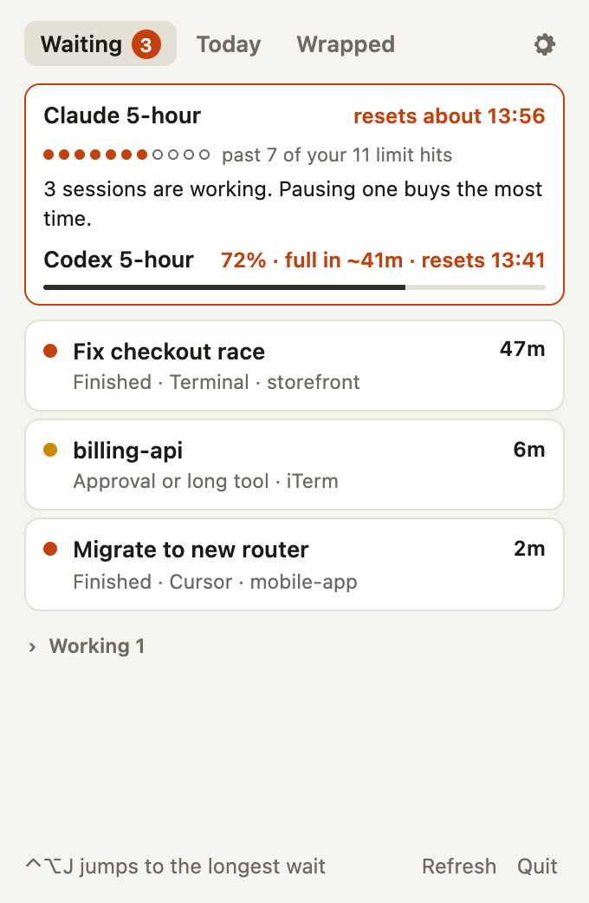
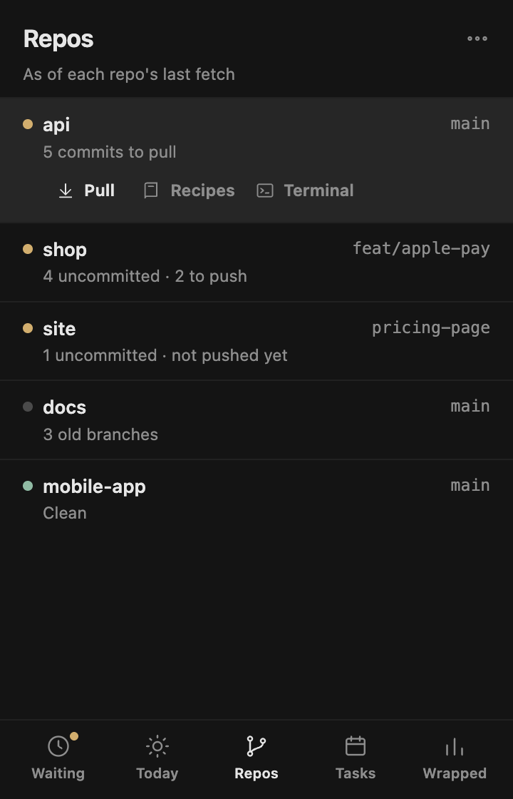
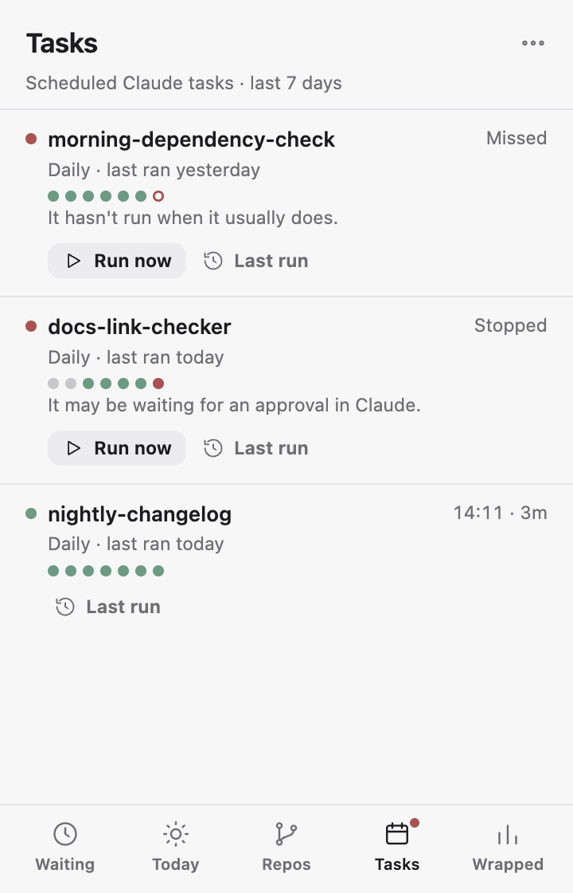

<p align="center">
  
</p>

<h1 align="center">Agent Island</h1>

<p align="center">
  <b>See what your coding agents are doing, and what they cost you. Locally.</b><br>
  A menu-bar app for people who run Claude Code, Codex, Cursor, and Antigravity all day.
</p>

<p align="center">
  
  
  
  
  <a href="LICENSE"></a>
  <a href="https://github.com/akimisri17/agent-island/actions/workflows/app.yml"></a>
</p>

<p align="center">
  
  &nbsp;
  
  &nbsp;
  
</p>

<p align="center"><sub>Screenshots use made-up demo data. Project page: <a href="https://akimisri17.github.io/agent-island/">akimisri17.github.io/agent-island</a></sub></p>

## Why

If you run several agents at once, two things happen every day:

1. **An agent finishes or stops to ask you something, and you don't notice.** It sits there until you happen to look.
2. **You hit a usage limit in the middle of a task,** with no warning beforehand.

Usage meters show how much is left right now. Agent Island tracks the sessions themselves: how much work your agents did, how long they sat waiting for you, and where your limits went. It does this across agents, from data already on your machine. Nothing is sent anywhere.

## What you get today

Click the menu-bar icon for a small panel with five tabs along the bottom: **Waiting**, **Today**, **Repos**, **Tasks** and **Wrapped** (keys **1** to **5** switch between them). The **⋯** menu in the corner has Refresh (⌘R), Settings (⌘,), Open full report and Quit. The panel also opens over full-screen apps.

### Waiting: press ⌃⌥J

Press **⌃⌥J** (Control-Option-J) from anywhere to jump to the session that has waited longest for you. To use a different shortcut, open Settings from the ⋯ menu, click the hotkey, and press a new one. The number next to the menu-bar icon shows how many sessions are waiting.

- **Finished:** the agent ended its turn and is waiting for your next message.
- **Approval or long tool:** a tool call has gone more than 20 seconds without a result. From the log alone, a long build and a pending approval look the same, so the label says both.
- **Idle:** a tool call or approval has gone unanswered for more than 30 minutes, which means the session stopped rather than needing you now. Idle and working sessions sit in collapsed groups below the list and don't count toward the menu-bar number.
- **Where the jump lands:**
  - macOS:
    - Terminal and iTerm: the exact tab.
    - VS Code, Cursor, Windsurf, Zed: the window for that folder.
    - Anything else, such as the Claude desktop app, Ghostty or Warp: the app comes to the front.
  - Windows (not yet tested on a real machine):
    - VS Code, Cursor, Windsurf, Zed: the window for that folder.
    - Windows Terminal, the Claude desktop app, WezTerm, Alacritty and others: their window comes to the front. Windows Terminal can't be asked for a specific tab.
- **Covers** running Claude Code and Codex sessions, and Cursor chats. Cursor runs every chat inside one app, so while Cursor is open, chats active in the last 12 hours count as live. Cursor also says whether you've read the reply yet. Plugin- and script-driven sessions are left out.

The Waiting tab lists the same sessions, longest wait first. Click one to jump to it.

**Cut off by the limit.** After a Claude limit resets, the sessions it stopped mid-task show up in their own section, along with sessions you interrupted and never went back to. **Resume** jumps to the session if it's still open, and otherwise runs `claude --resume` for it in your terminal app. **Hide** removes a row you don't want back.

### Limits: where you stand, without made-up numbers

The top of the Waiting tab shows your limits, but only what local data can actually back up:

- **Claude 5-hour, when you're limited:** the exact reset time, taken from the rejection Claude itself logged.
- **Claude 5-hour, otherwise:** one dot for each past time you hit the limit, filled once this window has used more than you had used then. For example: *past 7 of your 11 limit hits*.
- **Codex:** the official `used_percent` and reset time for each window, read from Codex's own logs, plus "full in ~N min" from how fast the percentage is rising.
- **One suggested move** when you're close: pause one of several working sessions, use a smaller model, or save long runs for after the reset.
- **Notifications:** at most one per window when you get close, one when a Claude limit is reached, and one when it resets. You can switch them off in Settings, which also has a button to send a test notification.

Why there's no Claude percentage: Claude's logs only record the moment you hit a limit, and the 5-hour limit is shared with claude.ai and desktop chats, which leave no trace on your machine. On real data, usage before a limit hit varied more than 3× from one hit to the next, so any percentage would be invented.

### Today: your daily recap

The **Today** tab shows what agents did today, project by project:
- time spent, which agents, the session titles, files touched
- today's git commits in those repos (your own commits, by your git email)
- what's still waiting on you, and which session to pick up next

**Copy standup** puts a standup-ready version on your clipboard: **Done** (today's commit messages), **In progress** (session titles by project) and **Next** (the session that has waited longest). Agent names, minutes, file counts and your waiting list stay in the panel, not in what you paste.

**Polish** is optional and off by default. Turn on Polish with Claude in Settings, and it rewrites the recap through *your own* installed `claude` command (`claude -p`), using your plan's usage. This sends today's session titles, project names and file names to Claude. It runs with no tools, without saving a session, and without your user plugins or hooks. It's the only thing in Agent Island that sends anything off your machine, and only when you click it.

### Repos: what each repository needs

The **Repos** tab has one row for each repository your agents worked in today: the branch, and what you'd do next in plain words (*5 commits to pull*, *4 uncommitted · 2 to push*, *3 old branches*). Repositories that need you come first. It only reads local git, so "to pull" is as of each repo's last fetch.

Select a row for its actions:
- **Pull:** shows the exact command (`git pull --ff-only`) and asks first. It only fast-forwards, and stops if it would need a merge. It's offered only when there's something to pull and nothing uncommitted.
- **Delete N old branches:** lists local branches already merged into the main branch, or whose branch was deleted on the remote after the pull request merged, and deletes only your local copies after you confirm.
- **Terminal:** opens your terminal app in that folder. Pick the app in Settings (Terminal, iTerm, Ghostty, and others it finds installed).
- **Recipes:** saved kick-off prompts for that repository, such as *pull main, install, run the tests, start the dev server*. **Start** opens a new Claude session with it in your terminal. Prompts you've typed three or more times in that repository are suggested as recipes.

### Tasks: scheduled Claude tasks

The **Tasks** tab lists your scheduled Claude tasks and how they've gone:
- **Missed:** it hasn't run when it usually does.
- **Failed** or **Stopped:** the last run ended in an error, or got stuck, often waiting for an approval nobody was there to give.
- **Running**, or the time it last ran and how long it took.
- **Seven dots** for the last seven days.
- **Run now** starts it, and **Last run** opens the last run's session.

A red dot on the tab means something needs a look. A notification when a run is missed, fails or gets stuck is on by default and can be switched off in Settings.

### Wrapped

Switch to **Wrapped** in the panel for a quick summary. Open the full report for the rest.

- **A persona and two badges** picked from your own data: *The Conductor* (many agents at once), *The Absent Boss* (agents waiting on you), *The Polyglot* (several model makers), and 16 more.
- **Agent-hours**: how long your agents actually worked.
- **Hours your agents waited on you**: finished work sitting idle until your next prompt.
- **Usage-limit hits**, with when each limit reset.
- **Peak parallel agents**, busiest days, and the hour your agents work most.
- **An agents table**: sessions, prompts, hours, and responses for each agent.
- **Models grouped by maker** (Anthropic, OpenAI, xAI, Google, …).
- **Where the tokens went**: by project, by model, cache re-reads, subagents, and context compactions.
- **Filters**: one agent (Claude Code, Codex, Cursor, Antigravity) or one model maker (Anthropic, OpenAI, xAI, …) at a time, in the panel and the report.
- **A share card**: numbers only, with no project names, prompts, or paths.
- **Where you approve the most** (in the panel): for each project, about how many tool calls had to ask you for permission, which commands they were, how long they waited for you (median), and how often you replied with just "go ahead". **Allow these…** offers allow-rules for routine build and test commands only, shows them, and after you confirm adds them to that project's `.claude/settings.local.json`. It's the one place Agent Island writes to an agent's settings, and only when you click it. The counts are estimates from the logs.

### Settings

Open from the ⋯ menu: the jump hotkey, which terminal app to open, limit notifications (with a test button), task notifications, and Polish with Claude.

<p align="center">
  
</p>

<details>
<summary><b>Full report preview</b></summary>
<br>
<p align="center"></p>
</details>

## Supported agents

| Agent | What it reads | Tokens | Status |
|---|---|---|---|
| **Claude Code** | `~/.claude/projects/**/*.jsonl` | ✅ | supported |
| **Codex** | `~/.codex/sessions/**/*.jsonl` | ✅ | supported |
| **Cursor** | Cursor's local chat database `state.vscdb`, opened read-only | ✗ (Cursor doesn't store them on disk) | supported |
| **Antigravity CLI** | `~/.gemini/antigravity-cli/conversations/*.db`, opened read-only | ✗ (not readable reliably) | supported |
| Antigravity IDE | `~/.gemini/antigravity-ide` | | not possible: conversations are encrypted |
| Gemini CLI | `~/.gemini/tmp/*/chats` | | next |
| GitHub Copilot CLI | `~/.copilot` | | next: needs someone with session data to test |
| Qwen Code, OpenCode | local session files | | planned |

Any model these agents call shows up automatically: Claude, GPT, Grok, Gemini, Qwen, DeepSeek, and so on. Browser chats (chatgpt.com, grok.com, claude.ai) keep no history on your machine, so they aren't included.

## Install

### Download

Installers for macOS (Apple silicon and Intel) and Windows are built by [GitHub Actions](https://github.com/akimisri17/agent-island/actions/workflows/app.yml) and will be published on the [Releases](https://github.com/akimisri17/agent-island/releases) page.

**The builds are not signed yet.** The first time you open it:

- **macOS:** drag **Agent Island** into Applications and open it. macOS says it *"could not verify"* the app: click **Done**, not Move to Bin. Then either:
  - open **System Settings → Privacy & Security**, scroll to *"Agent Island" was blocked*, click **Open Anyway**, and open the app again; or
  - run this once in Terminal, then open the app:
    ```bash
    xattr -dr com.apple.quarantine "/Applications/Agent Island.app"
    ```

  Right-click → Open no longer works for unsigned apps on recent macOS.
- **Windows:** on the SmartScreen prompt, click **More info** → **Run anyway**.

### Try it without installing

The same report, as a command (Node 20+, no dependencies):

```bash
git clone https://github.com/akimisri17/agent-island.git
cd agent-island
node wrapped/bin/agent-wrapped.mjs          # your last 30 days
node wrapped/bin/agent-wrapped.mjs --demo   # made-up data, no logs needed
```

Options: `--days 7`, `--agent cursor`, `--maker xAI`, `--out report.html`, `--json`, `--no-open`. An `npx agent-wrapped` package is coming.

### Build from source

Needs Node 20+ and Rust ([rustup](https://rustup.rs)).

```bash
cd app
npm install
npm run dev                          # run it
DEMO=1 npm run preview               # the panel in a browser, made-up data
npm run build -- --bundles app,dmg   # macOS .app and .dmg
```

## Privacy

- **Nothing leaves your machine.** No account, no telemetry, no analytics, no server. The one exception is the optional **Polish with Claude** button on the Today tab: it's off until you turn it on, and it uses your own `claude` command.
- **Read-only, unless you click.** It reads agent logs and databases without changing them. The only writes are ones you confirm: Pull and Delete old branches in your own repositories, and Allow these… adding rules to a project's `.claude/settings.local.json`. SQLite databases are opened so that no files are created next to them; a test checks this.
- **Not your prompts.** It counts messages and tools and reads timestamps and model names. Prompt text is never stored or shown. The report does show project names and the session titles your agents generate, blurred until you choose to reveal them.
- **No network.** The app's content security policy blocks network requests, and the HTML report loads no fonts or scripts from anywhere.
- **No screen recording, no Accessibility permission, no keychain access.** Jumping to a Terminal or iTerm tab asks macOS for permission to control that app. It only selects the tab and never reads or types anything.
- **Share safely.** The share card has numbers only. The report blurs project names until you untick the box.

## How it works

```
 ~/.claude/projects   ~/.codex/sessions   Cursor state.vscdb   ~/.gemini (Antigravity)
          \                  |                  |                  /
           Rust log readers (app)  ·  Node log readers (CLI)
                             |
            one record per session: prompts, turns,
            models, tools, files, limit hits
                             |
          stats.mjs  →  personas.mjs  →  render.mjs   (shared)
                 /                           \
       menu-bar panel                  HTML report + share card
```

- **Turns:** each prompt you type starts a turn, and the agent's activity extends it. Time from the end of a turn to your next prompt counts as *waiting on you*. Gaps over an hour count as you being away.
- **Agent-hours** are capped at 3 hours per turn, so a forgotten loop doesn't inflate them. Parallel sessions add up.
- **Projects** are the folder an agent worked in. Git worktrees count toward their repository.
- **Sessions you started** are ones with at least one prompt you typed. Plugin-driven, scheduled and subagent runs count toward tokens only. Text the agent injects (shell command output, local commands, context blocks) isn't counted as a prompt, and a resumed or forked session counts once.
- **Battery:** the full log read for Wrapped happens only when the app starts and when you open the panel, at most once every 5 minutes. Reading about 6 GB takes about 4 seconds. The waiting count refreshes once a minute: one process listing plus the end of each running session's log, about 35 ms.
- **Live sessions** are matched to running `claude` and `codex` processes by working folder, or by `--resume` id when one is given.

The Rust readers and the Node readers are tested against the same sample files, and they give identical numbers on real logs.

## The honest caveat

None of these agents publish a stable format for their local logs. Agent Island reads what each tool writes for itself, and that can change in any release. When a format changes, a reader may undercount or skip a source. It should never invent numbers. Cursor and Antigravity are the most fragile: Cursor is an internal database, and Antigravity stores undocumented binary (protobuf) records. Neither gives token counts we can trust.

Windows installers build in CI, but the app hasn't been run on a real Windows machine yet. Reports from Windows users are very welcome.

Personas are judged against thresholds that are guesses for now. They'll be tuned once there's real data from more people.

## Roadmap

- [x] **Wrapped**: report, persona and badges, share card, menu-bar panel
- [x] Claude Code, Codex, and Cursor
- [x] Antigravity CLI
- [ ] Gemini CLI, Copilot CLI, Qwen Code
- [x] **Waiting**: ⌃⌥J jumps to the session that has waited longest; count in the menu bar
- [x] Waiting: Cursor chats
- [x] Settings: choose your own hotkey
- [x] Waiting: Windows jump (built, not yet tested on a real Windows machine)
- [ ] Waiting: Antigravity live sessions
- [x] **Limits**: exact reset when limited, how this window compares with your past limit hits, official Codex percentages, one suggested move
- [x] Limits: notifications when close, when limited, and on reset
- [ ] Limits: Claude's weekly limit (no local data for it yet)
- [x] **Today**: daily recap with commits, copy for standup, optional polish by your own `claude -p`
- [x] **Repos**: status per repository, Pull, delete old branches, open a terminal, recipes
- [x] Waiting: resume sessions cut off by the limit
- [x] **Tasks**: scheduled Claude tasks, missed, failed and stuck runs
- [x] Wrapped: where you approve the most, with allow-rules for routine commands
- [ ] Signed releases, Homebrew, `npx agent-wrapped`

## Repository layout

| Path | What |
|---|---|
| `app/` | The desktop app (Tauri): Rust readers, menu-bar panel. See [`app/README.md`](app/README.md) |
| `wrapped/` | Node readers, stats, personas, report, and the CLI. The app copies the shared code in at build time. See [`wrapped/README.md`](wrapped/README.md) |
| `docs/media/` | README and site images, made from demo data |
| `site/` | Project page, published to GitHub Pages from `main` by `.github/workflows/pages.yml` |
| `.github/workflows/app.yml` | Tests, then macOS and Windows installers |

## Contributing

Issues are the roadmap. The most useful ones:

- **A missing agent.** Say which tool you use and where it stores sessions.
- **A number that looks wrong.** Include the output of `node wrapped/bin/agent-wrapped.mjs --json` and what you expected. It has no prompt text, but it does list project names and session titles, so edit those out first.
- **A persona that doesn't fit you.**

Before sending a PR, run both test suites:

```bash
cd wrapped && npm test
cd app/src-tauri && cargo test --lib
```

## License

[MIT](LICENSE) © 2026 Akhil Misri
